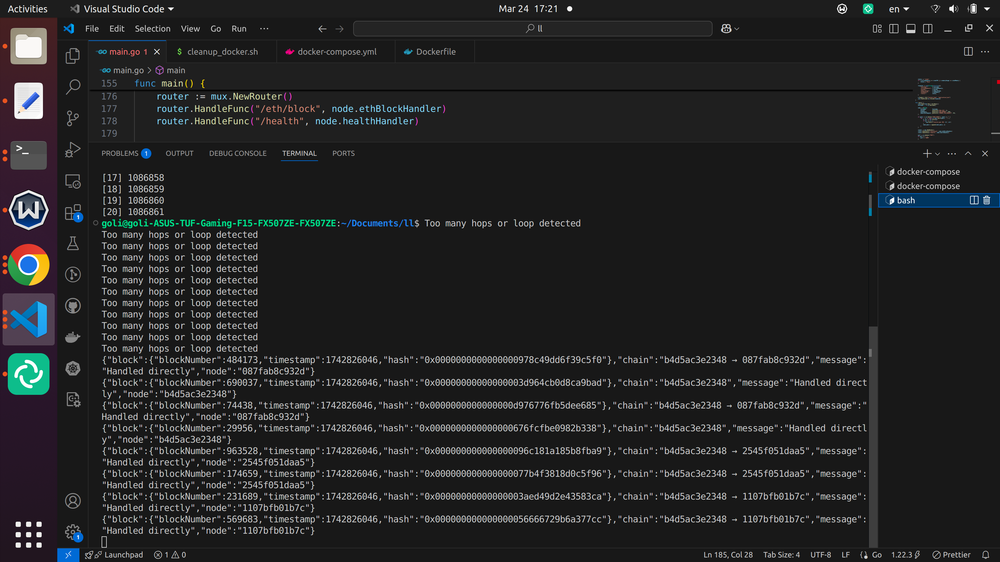
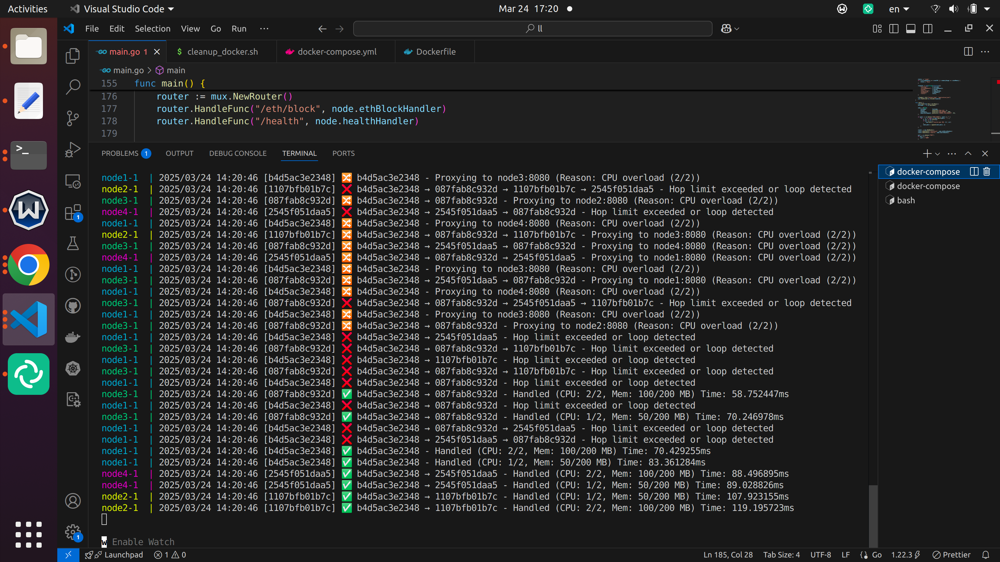

# Log Screenshots for EthLoadBalancer

This file contains screenshots from the logs of the `EthLoadBalancer` project, showcasing how the system handles requests under different conditions. These images illustrate key behaviors such as direct request handling, proxying to peer nodes when resources are constrained, and request rejection due to hop limits or loops. The logs provide a visual representation of the load balancing in action, making it easier to understand the system's distributed nature and resource management.

Below are the captured moments from running the application with Docker Compose, demonstrating various scenarios encountered during testing.

